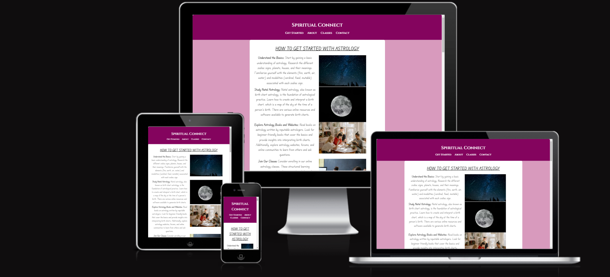

# Spiritual Connect
The Spiritual Connect website is designed to allow beginners to have an idea of what astrology is and how to find their way around it. It offers a comprehensive platform that aims to guide individuals on their spiritual journey and provide valuable resources to explore mystical and esoteric topics. 

To cater to specific needs and interests, the spiritual website also enables visitors to send inquiries regarding various spiritual practices, healing modalities, and divination methods. Whether seeking guidance on tarot readings, crystal healing, or meditation techniques, users can connect with experienced practitioners who offer personalized responses to their questions. 

Link to deployed website: https://melisaavr.github.io/spiritual-connect/

## Features

### Navigation 
It is located at the top of the page under the header. 
The navigation links: get started, about, classes, contact us offer links to the relevant sections. 
The text is in subtle "middle ages" font which is relevant because astrology dates back to the middle ages and when the so-called "witch" profile was more prevalent.

### The Header
The header shows the name of the website and reflects a community with the "connect". 
It is placed in the middle, with the navigation right below it. This is so that it is emphasized and set apart from the rest of the content.
Text colour is white above a dark purple background. This signifies power and wisdom. 

### Get Started 
Offering people a list of "how to get started" with astrology holds immense significance as it acts as a valuable roadmap for beginners embarking on their learning journey. Such lists provide a structured and organized approach, helping individuals navigate through the initial complexities and uncertainties that often accompany delving into a new subject. 

### About Us
The "About Us" section of Spiritual Connect holds great significance as it serves as the digital identity and personality of the organization or individual behind the website. This section provides a unique opportunity to establish a connection with the website's visitors by sharing the story, values, and mission of the entity. By offering insights into the background and expertise of the creators, the "About Us" section builds trust and credibility, reassuring visitors that they are dealing with genuine and knowledgeable individuals.
[Title](<about us_png>)

### Classes table
The inclusion of a table with "events, date, and time" on a website holds tremendous significance as it provides visitors with a clear and organized overview of upcoming activities or important occasions. The table format allows for easy comprehension and quick reference, enabling users to swiftly identify relevant events, their respective dates, and scheduled times.

### Contact Us Form
The "Contact Us" section of Spiritual Connect is of paramount significance as it serves as the primary gateway for communication. This section provides a direct and accessible means for individuals to connect with the website's owners, be it an organization or individual, for inquiries, feedback, support, or any other relevant matters. This will be more useful when the information entered has somewhere to reach. 

## Testing
All tests have been carried out and the page works in browsers such as google chrome and Firefox. 

Responsiveness: responsiveness test passed. 

The navigation, header and the whole website in general are easy to read and use. 

### Bugs

### Solved Bugs
Error caused due to space in between image names. This is now fixed. 

The closing p tag was visible although there was not an opening p tag. This is fixed. 

The images were saved with "." instead of "_" which is now fixed.

## Validator Testing
HTML - No errors visible with W3C HTML validator

CSS- No errors visible with W3C CSS validator (jigsaw)

Accessibility - passed using lighthouse in devtools.

### Unsolved Bugs
I am aware that there are way too many "read me edit" pushed to github and this is not the correct way to push code. I will not repeat this again. 

## Deployment
GitHub Pages were used to host the website. The following are the deployment steps:
Go to the Settings tab in the GitHub repository.
Click "Save" after selecting the Main Branch from the drop-down menu for the source section.
The page will automatically reload with a thorough ribbon display to show that the deployment was successful.

The [link] (https://melisaavr.github.io/spiritual-connect/) can be found here. 

## Credits

### Content
Used examples from the love running projects and went back to learning and videos to expand my horizons and recap. 

### Media
The images were all taken from [pexels](https://www.pexels.com/)
Read me [guidance] (https://www.youtube.com/watch?v=a8CwpGARAsQ&ab_channel=TheGitGuild)
Flexbox [help] (https://www.youtube.com/watch?v=hwbqquXww-U&list=PL4-IK0AVhVjMSb9c06AjRlTpvxL3otpUd&ab_channel=KevinPowell)

